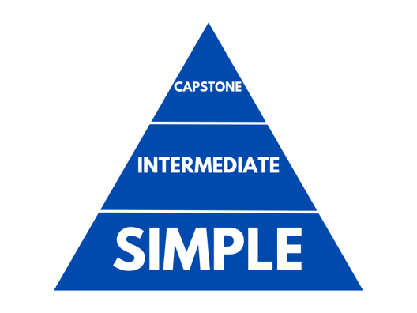

# 3 Levels of Portfolio Projects

This is my Python portfolio using the project pyramid as a guideline for the level of projects that I complete. 

## Level 1: Basic
- guess_number.py: number guessing game
- rock_paper_scissors.py: rock paper scissors (practice with functions, if statements, and control flow)
- hangman.py: practice with importing module
- Currency Converter shows the current exchange rate to the top 10 most traded currencies. Uses API from Forex-Python import

## Level 2: Intermediate
- tic-tac-toe: Includes 2 game modes that allow users to either play against another opponent or against an unbeatable AI.
- snake_game.py: classic game practice with Object Oriented Programming
- slot_machine.py: a game that receives multiple inputs from the user. Taking a deposit and allowing users to play a bet on multiple lines of a random slot machine. Then keeps track of the winnings and loses. Allows users to end the game and make a withdrawal. Odds and customizable. 
- pong.py: Classic pong game that allows two users to play. 
- Note-taking app with sign-up and authentication using Flask
- Task Master: Todo list using Flask and SQLAlchemy
- Chat app: Flask and SocketIO
- Currency Converter using API
- Automated tasks
    - email sender: python to send an automated email. 
    - youtube downloader: download a youtube video as a mp4
    - scheduled file backup: create and schedule a automated back-up file

## Level 3: Capstone
- Puddle - Django powered eCommerce store that allows users to create an account and post listings of goods to sell. Included is a dashboard for the user to track what items they have listed. Including an Inbox for users to contact seller about products. 
